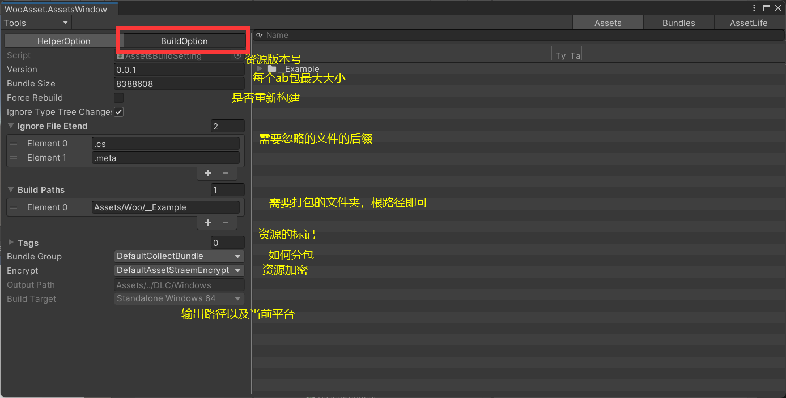
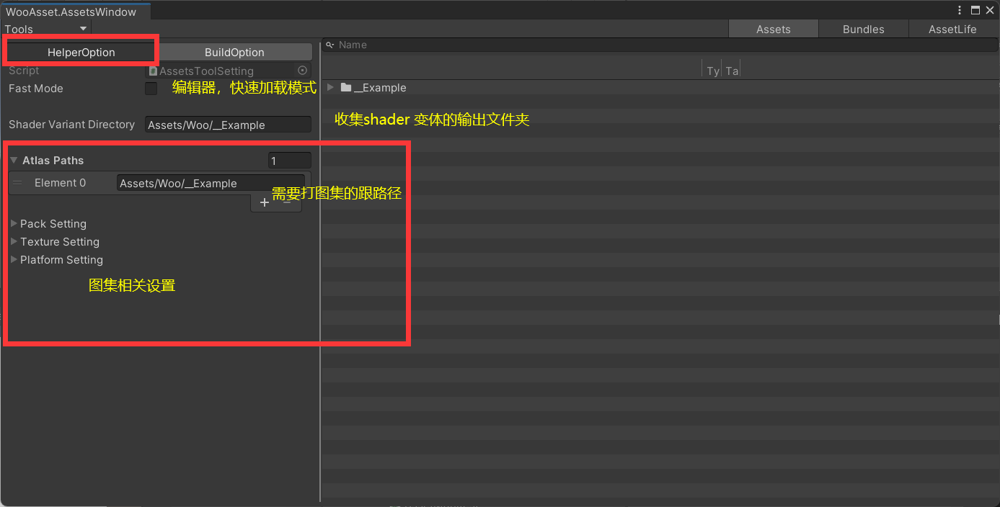
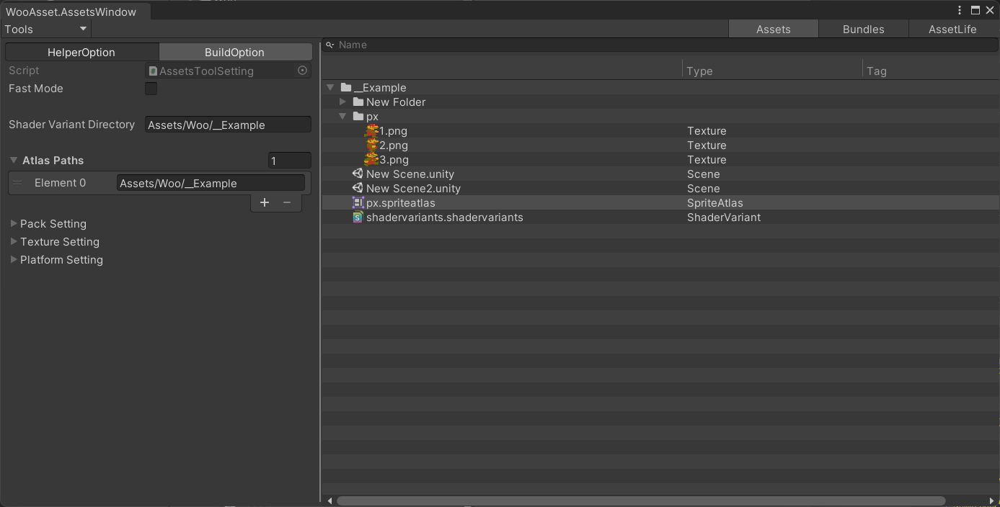

# WooAsset
* 简单
* 高效
* 易扩展
## 支持以下模式
 * 0 编辑器模拟加载         (纯粹编辑器模拟)
 * 1  纯粹的C#空包，   （注意：本地不会有任何ab）
 * 2 发布 正常流程包       （比模式1 多一个版本检查）
 * 3 发布 游戏前期的体验包  (把资源拷贝到stream)

| 模式/流程          | 编辑器模拟加载 | 纯粹的C#空包 | 发布 正常流程包 | 发布 游戏前期的体验包 |
| ------------------ | :------------: | :----------: | :-------------: | :-------------------: |
| 打包流程           |
| 勾选FastMode       |       ✔        |              |                 |                       |
| 打包资源           |                |      ✔       |        ✔        |           ✔           |
| 拷贝资源到stream   |                |              |                 |           ✔           |
| 上传资源到服务器   |                |      ✔       |        ✔        |                       |
| 运行时加载流程     |
| 设置AssetsSetting  |       ✔        |      ✔       |        ✔        |           ✔           |
| 拷贝资源到沙盒路径 |                |              |                 |           ✔           |
| 版本检查           |                |              |        ✔        |                       |
| 初始化             |       ✔        |      ✔       |        ✔        |           ✔           |
| 正常加载           |       ✔        |      ✔       |        ✔        |           ✔           |

---
## 如何加载
~~~ csharp 
    AssetsSetting set;
    string path;
    ///设置AssetsSetting
    Assets.SetAssetsSetting(set);
    ///拷贝资源到沙盒路径
    await Assets.CopyDLCFromSteam();
    ///版本检查
    var op = await Assets.VersionCheck();
    for (int i = 0; i < op.downLoadOnes.Count; i++)
        await Assets.DownLoadBundle(op.downLoadOnes[i].bundleName);
    ///初始化
    await Assets.InitAsync();
    ///正常加载
    var asset = await Assets.LoadAssetAsync(path);
    var sp = asset.GetAsset<Sprite>();
~~~
## 如何打包
* 1 打开窗口
  * [MenuItem("WooAsset/Open")]
* 2 设置好打包相关参数
  | 参数          | 解释                                 |
  | ------------- | :----------------------------------- |
  | version       | 这一次打包出去的带的版本号           |
  | bundle size   | 打包出来的最大的bundle 大小          |
  | force rebuild | 强制重新打包                         |
  | ignore extend | 通关文件后缀排除不需要打包的文件     |
  | build path    | 需要打包的文件夹，一个根路径即可     |
  | tags          | 资源的标记，和 bundle group 混合使用 |
  | bundle group  | 用来把所有资源分组的脚本             |
  | encrypt       | ab 的加密方式                        |
  
* 3 点击 tools/bundle/build
## 可选项
* 收集shader变体/打图集/编辑器快速加载
  
* 关于 tag
  * 打包参数里面 tags 列举所有的tag
  * 执行 tools/preview/ just collect assets
  * 在右边的串口选好想要设置的资源
  * 鼠标右键 即可
  * 在运行时 可以根据tag 获取一组资源，同时加载与卸载
* 关于分组
     * 写一个继承于ICollectBundle的类
     * 打包参数里面 bundle group 选中 它
     * 默认的打包分组逻辑
       * 把所有tag相同的资源分组
       * 把剩下的资源分组
* 关于加密
 * 写一个继承于IAssetStreamEncrypt的类
 * 打包参数里面 encrypt 选中 它
* 关于窗口   （点击窗口左上角切换页签）
  * Assets    需要打包的所有资源的预览
  * Bundles   打爆出来的bundle 预览
  * AssetLife 资源运行时的使用情况
  
### 我们（QQ 782290296）
### 欢迎加入我们一起交流
