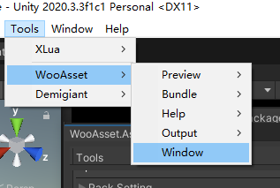
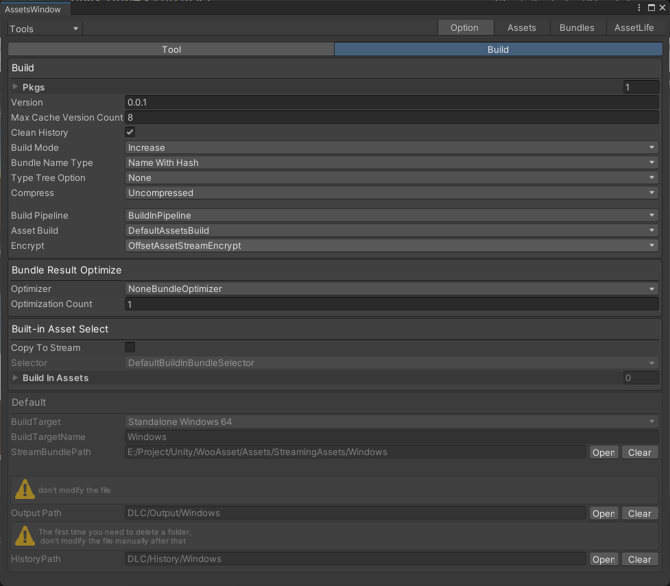
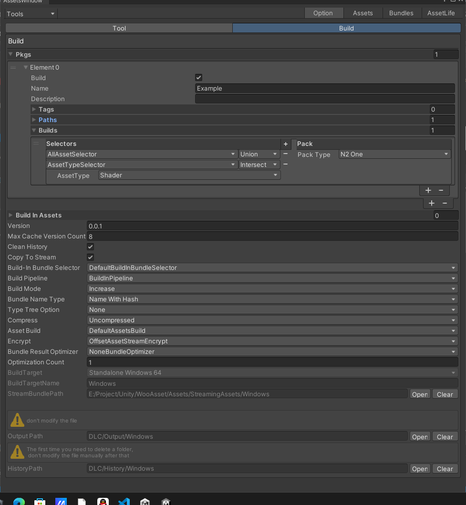

# 配置
## 第一次使用
* 打开编辑器窗口，操作如下图
* 成功后，会在Assets/Editor目录下看到两个配置文件
* 其中 AssetsEditorCache 可以删除（团队协作时候，不需要同步）
  

## 配置资源

| 名字                     | 描述                                                                         |
| ------------------------ | ---------------------------------------------------------------------------- |
| Pkgs                     | 资源包配置组                                                                 |
| Version                  | 此次打包出去的版本                                                           |
| MaxCacheVersionCount     | 远程版本记录文件最大版本个数                                                 |
| CleanHistory             | 打包结束后是否删除和本次打包无关的历史文件夹                                 |
| Build Pipeline           | 管线 内置 /SBP                                                               |
| build mode               | 打包模式（是否增量式）                                                       |
| bundle name type         | 输出Bundle名称风格（名/名_Hash/Hash）                                        |
| type tree option         | Bundle类型信息                                                               |
| Compress                 | Bundle压缩格式 （LZ4/LZMA/不压缩）                                           |
| Asset Build              | 自定义打包流程（可扩展）                                                     |
| Encrypt                  | 文件加密方式(可扩展)                                                         |
| 打包结果二次构建         |
| Bundle Result Optimizer  | 对构建结果优化 (可扩展)(合理化分包，处理循环依赖、冗余，颗粒度.....)         |
| Optimization Count       | 优化迭代次数                                                                 |
| 下面是内建资源选择       |
| Copytostream             | 拷贝资源到stream，                                                           |
| BuildInAssets            | 在把bundle拷贝到stream时候，根据这个配置决定拷贝哪些bundle（不配置拷贝全部） |
| Build-In Bundle Selector | 内建资源选择器  （可扩展）                                                   |
| 下面都是默认值           |
| Build Target             | 当前打包的平台                                                               |
| BuildTargetName          | 目标平台名字                                                                 |
| stream bundle directory  | stream保存资源的文件夹                                                       |
| Output Path              | 输出路径                                                                     |
| History Path             | 历史文件所在文件夹，第一次打包时候把他删了，后续不要动里面的文件             |

### 资源组介绍
| 名字        | 描述                                                            |
| ----------- | --------------------------------------------------------------- |
| Build       | 该组是否需要打包 （给分布式打包使用）                           |
| Name        | 包的名字（不可重复，不为空）                                    |
| Description | 对包加点描述                                                    |
| Paths       | 对应的项目路径  （不可重复，不为空）                            |
| Tags        | 对包加一些标记                                                  |
| builds      | 分包规则       （也可以纯粹代码分包，但是此项目不可以存在配置） |

* 每个资源组均可以分开打包，更新，加载
* 保持好良好的资源组结构，方式生成过多冗余