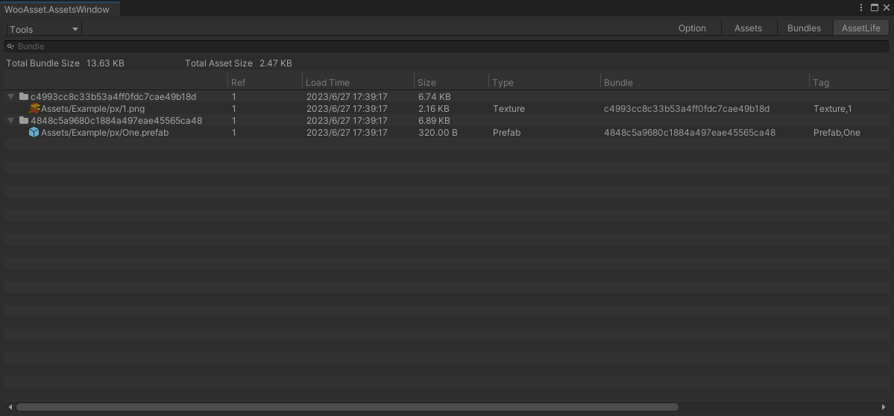

# 工具
## 收集资源预览（Option/Tools页签）

### AssetMode
* Normal  正式的模式
* Rude    粗鲁的，纯粹的编辑器加载，不需要任何配置
* AssetDatabase  与 Normal 差不多，但是 不需要打包，是编辑器模拟

### Simulator
* EditorSimulatorPath  (编辑器状态下，Bundle存储的位置)
* ServerDirectory  (打包后，资源所在目录)（上传到CDN拷贝词目录即可）
* Enable Server （是否开启本地资源模拟服务）
* Server Port  （模拟服务绑定的端口）

### Shader Variant 防止 着色器丢失 
* Shader Variant Input Directory （需要收集SHader 变体文件夹）
* Shader Variant output Directory （shader 变体输出文件夹）
* （如何执行）点击Tools/WooAsset/Help/ShaderVariant

### Sprite Atlas  打图集 
* 设置好图集相关设置
* 点击Tools/WooAsset/Help/SpriteAtlas

### AssetTags 
* 用于标记 某一个资源有哪些标签（资源和标签是N2M的关系）
* 一个资源可以有多个标签
* 运行时可以按照标签加载/准备相应的资源
* 编辑器
    * 配合自定义内置资源选择器选定内建资源
    * 分包
    * 分包优化

### Record Ignore  
* 规定一些资源不记录到资源清单内
* 属于优化选项，可以减小资源清单文件的大小
* 为什么要这个做？
  * 并不是所有的资源都需要主动加载
  * 比如加载一个Cube预制体、往往我们并不关心他的mesh是什么样的
  * 如果连这种mesh都要记录会导致资源清单文件巨大
  * 为了节约流量、减少序列化时间、提升玩家体验
* 哪些资源适合？满足以下条件
  * 1、未在AssetReference中使用
  * 2、不需要用代码指定路径加载的资源->即其他资源依赖的资源，属于运行时被动加载的
* 例子
  * 一个Scene 内有 N 个预制体
  * 只需要标记场景文件，场景依赖的其他都是可以忽略的（包括预制体、材质、图片、shader、fbx 等）
  * 这样一个场景就可以节约很大一部分的清单文件的占用

## 收集资源预览（Assets页签）

* Tools/Preview/Asset(预览所有Pkg 内有哪些资源，会按照Pkg分组)(右上角切换Pkg)
* Tools/Preview/ALLAsset 与上一个相比（不会按照Pkg分组，其他一样）
* 可以方便的看到究竟打包了什么内容
* 双击资源可以定位
* 支持快速搜索
* 可以查看资源依赖情况

### AssetTags  [简介]
* 具体操作（在Assets页签，选中资源-》右键）
* 需要先在窗口  （Option/Tools页签/AssetTags） 中 预设tag
* 如果选中的是一个文件夹，就会标记该文件夹下所有文件
* 支持多选

### Record Ignore [简介]
* 具体操作（在Assets页签，选中资源-》右键）
* 如果选中的是一个文件夹，就会标记该文件夹下所有文件
* 支持多选

## 构建 Bundle 预览（Bundles页签）

* Tools/Editor Simulate(预览所有Pkg 分包情况，会按照Pkg分组)(右上角切换Pkg)
* 不会真的打包
* 可以查看每一个资源的依赖
* 可以查看每一个bundle的依赖
* 双击资源可以定位
* 支持快速搜索

## 资源加载情况（AssetsLife页签）

* 资源加载实践
* 当前有多少引用
* 资源的标签
* 资源所属的 bundle
* 支持快速搜索
